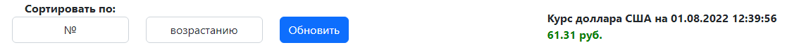
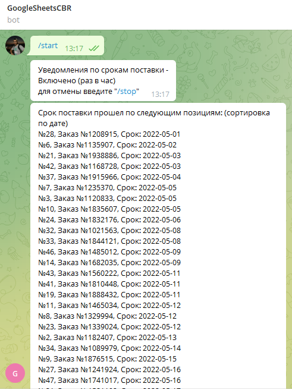
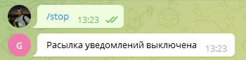
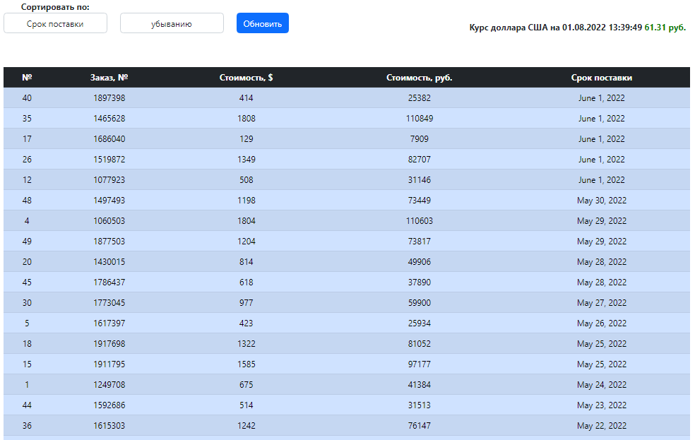
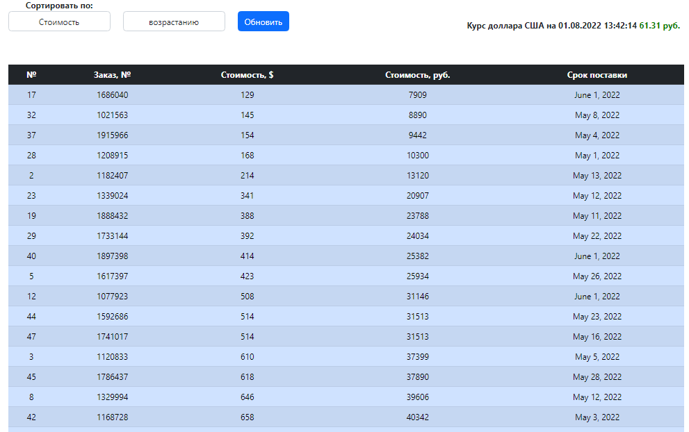

# Тестовое задание
### Разработка одностраничного web-приложения, которое:
### Задание №1 —Получает данные с документа при помощи Google API, сделанного в Google Sheets 
#### Решение:

Импорт необходимых библиотек
```shell
from googleapiclient import discovery  
from oauth2client.service_account import ServiceAccountCredentials
```

документ с которыми будем работать
```shell
    creadentials = ServiceAccountCredentials.from_json_keyfile_name(
        CREDENTIALS_FILE,
        ['https://www.googleapis.com/auth/spreadsheets',
         'https://www.googleapis.com/auth/drive'])
```
создаем объект аунтификации
```shell
httpAuth = creadentials.authorize(httplib2.Http())
```
создаем обертку API из которой мы будем получать данные из нашей схемы
```shell
service = discovery.build('sheets', 'v4', http=httpAuth)
```
Читаем данные, если весь то range='Лист1'
```shell
    values = service.spreadsheets().values().get(
        spreadsheetId=spreadsheet_id,
        range='Лист1',
        majorDimension='ROWS').execute()
```
### Задание №2 а. Данные должны добавляться в БД, в том же виде, что и в файле –источнике, с добавлением колонки «стоимость в руб.»
#### Решение:
Для записи данных в таблицу БД PostgreSQL используем функцию db_google_sheets().
Например создадим новую таблицу с колонкой "value_rub" («стоимость в руб.»)
```shell
         with connection.cursor() as cursor:
             cursor.execute("""
             CREATE TABLE test(
             id serial PRIMARY KEY,
             number integer,
             order_number integer,
             value_dolar int,
             value_rub int,
             delivery_time date);""")
```
### Задание №2 б. Данные для перевода $ в рубли необходимо получать по курсу ЦБ РФ
#### Решение:
Для получения текущего курса долара Центрального банка Росии по API используем функцию cbr_usd_api()

```shell
    url = f'http://www.cbr.ru/scripts/XML_daily.asp?date_req={day}/{mounth}/{year}'
    xml = xmltodict.parse(requests.get(url).content)

    for value in xml['ValCurs']['Valute']:
        if value['@ID'] == 'R01235':
            return (value['Value'])
```
### Задание №3 — Скрипт работает постоянно для обеспечения обновления данных в онлайн режиме (необходимо учитывать, что строки в Google Sheets таблицу могут удаляться, добавляться и изменяться).
#### Решение:
Обновление даных доступно на одностраничном web-приложении по нажатию кнопки "Обновить"

### Задание №4 a. Упаковка решения в docker контейнер
#### Решение: 
созданы два файла: "Dockerfile" и "docker-compose.yml". 
В "docker-compose.yml" доступны следующие сервисы:
- web- одностраничное web-приложение на Django;
- bot- Telegram bot уведомлений о просроченых поставках;
- pg_db- База данных PostgreSQL;
- pgadmin- web-сервис просмотра, работы с SQL запросами БД PostgreSQL.
### Задание №4 б.  Разработка функционала проверки соблюдения «срока поставки» из таблицы. В случае, если срок прошел, скрипт отправляет уведомление в Telegram.
#### Решение:
Написание Telegram бота представлено в файле "main.py". Используются библиотеки: "telebot", "multiprocessing", "schedule", "time".

Запускаем новый процесс
```shell
def start_process(msg): 
    global USER_ID
    USER_ID = msg.chat.id
    global p1
    p1 = Process(target=start_schedule(USER_ID), args=()).start()
```
Для того, что бы начать получать уведомления (раз в час) в Telegram нужно написать боту **@GoogleSheetsCBR_bot** "_/start_"


Используя модуль "schedule" настраиваем периодичность выполнения скрипта по проверке БД на просроченые поставки и отправления пользователю уведомления в Telegram. По умолчанию запросы/уведомления приходят раз в час.
```shell
schedule.every(3600).seconds.do(send_message1)
```
Если пользователь не хочет получать больше уведомления, нужно написать боту **@GoogleSheetsCBR_bot** "_/stop_"


### Задание №4 c. Разработка одностраничного web-приложения на основе Django или Flask.
#### Решение:
Для написания одностраничного web-приложения использовался Django, HTML, CSS, Bootstrap.
На веб странице предоставляется пользователю следующий функционал: 
- кнопка "Обновить" - обновляет страницу согласно актуальности данных в GoogleSheets и курса долара ЦБ РФ;
- сортировка данных по "№" (возрастанию/убыванию);
- сортировка данных по "Заказ, №" (возрастанию/убыванию);
- сортировка данных по "Стоимость" (возрастанию/убыванию);
- сортировка данных по "Срок поставки" (возрастанию/убыванию);

#### Сортировка данных по срокам поставки (по убыванию):


#### Сортировка данных по стоимости (по возрастанию):


На веб странице также доступна текущая информация по курсу долара ЦБ РФ


### Инструкция по запуску

Сервис упакован в Docker. Для запуска достаточно находиться в директории с файлом _'manage.py'_ и в терминале ввести следующее:
```shell
    docker-compose build
    docker-compose up
```

Доступ к веб сервису:
```shell
    http://127.0.0.1:8000/ - в браузере
```


Настройки для веб версии pgadmin:
```shell
    http://127.0.0.1:5050/ - в браузере
    Для подключения к серверу:
    host = "pg_db"
    user = "postgres"
    password = "123"
    db_name = "postgres"
    
```
Доступ к Telegram боту **@GoogleSheetsCBR_bot**
```shell
  основные команды:
  /start  # Для того, что бы начать получать уведомления (раз в час)
  /stop  # Отключение рассылки уведомлений
    
```